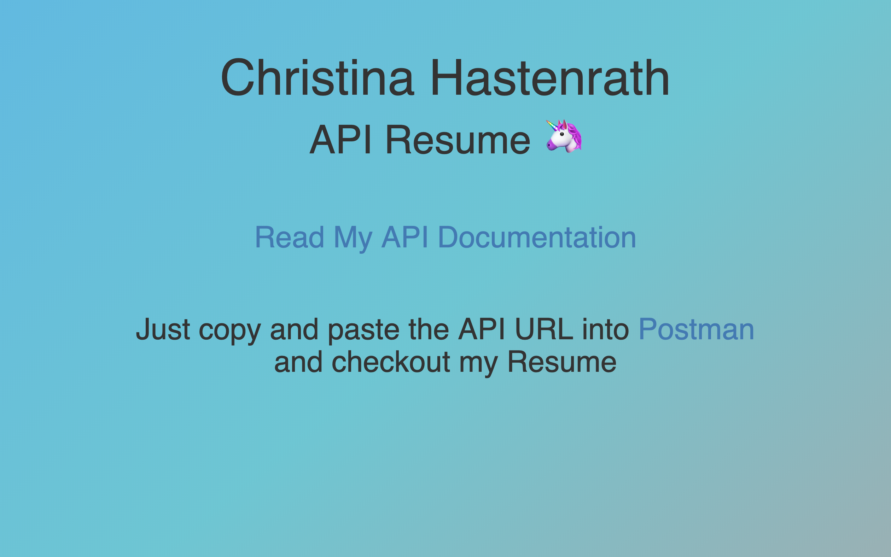

# personal_api_retake

This is my Resume turned into an API.
Follow the API link and copy and paste it in Postman to run GET requests. The endpoints will bring you to the designated sections of my resume. Voila, my API resume.

## Techstack: 
HTML/CSS
RESTful Routes
Express
Mongoose
bodyparser (middleware for JSON)
MongoDB
Heroku/mlab

## Project link
https://personalapiretake.herokuapp.com

## Further implementation

For further implementation I would like to add a full CRUD for all my videogames endpoint:
https://codeburst.io/writing-a-crud-app-with-node-js-and-mongodb-e0827cbbdafb

## Screenshots

